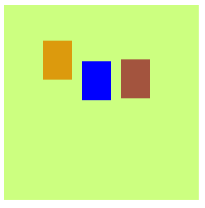

# Introducción a WebGL
## Agustín Alfonso González Iríbar



En este proyecto se renderizan, utilizando ```WebGL```, tres rectángulos que rebotan en los bordes superior e inferior de la pantalla y que cambian a un color aleatorio al impactar.

El objetivo de este proyecto es la introducción a como se desarrolla, compila y ejecuta una aplicación en ```WebGL```.

## Acceso a la versión web

La versión web de este proyecto se encuentra en [este sandbox de codesandbox](https://tdrfw6.csb.app/).

El código se puede acceder desde [este enlace](https://codesandbox.io/p/sandbox/webgl-practica-1-tdrfw6).

## Ejecución del proyecto en local

Es posible descargar o clonar el repositorio y abrir el fichero ``index.html`` con un navegador web aunque es más recomendable seguir los siguientes pasos:

1. Descargar o clonar el repositorio

2. Descargar e instalar la version mas reciente de ``Node.js`` desde [este enlace](https://nodejs.org/en)

3. Para asegurar que la instalación se realizó correctamente utilizar los siguientes comandos en un terminal o símbolo del sistema:

```
node --version
npm --version
```

4. Una vez correctamente instalado ejecutar el siguiente comando desde un terminal o símbolo del sistema en el directorio o carpeta en el que se encuentre el proyecto:

```
npm install
```

5. Una vez termine el comando anterior ejecutar el siguiente comando desde el mismo terminal o simbolo del sístema:

```
npm run start
```

6. Una vez ejecutado este comando se observará en la consola algo parecido a esto:
```
> webgl_p1@1.0.0 start
> parcel ./src/index.html

Server running at http://localhost:1234
```

7. Abrir un navegador y, en la barra de direcciones, escribir ```localhost:1234```

8. Para terminar la simulación, pulsar la combinación de botones ```Ctrl + C``` en la consola donde se realizó el paso 5
